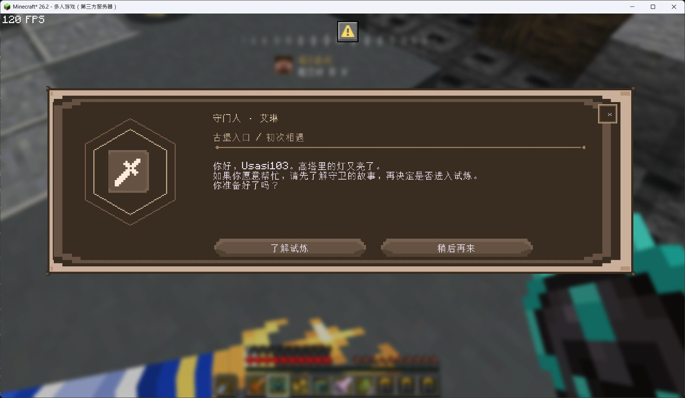
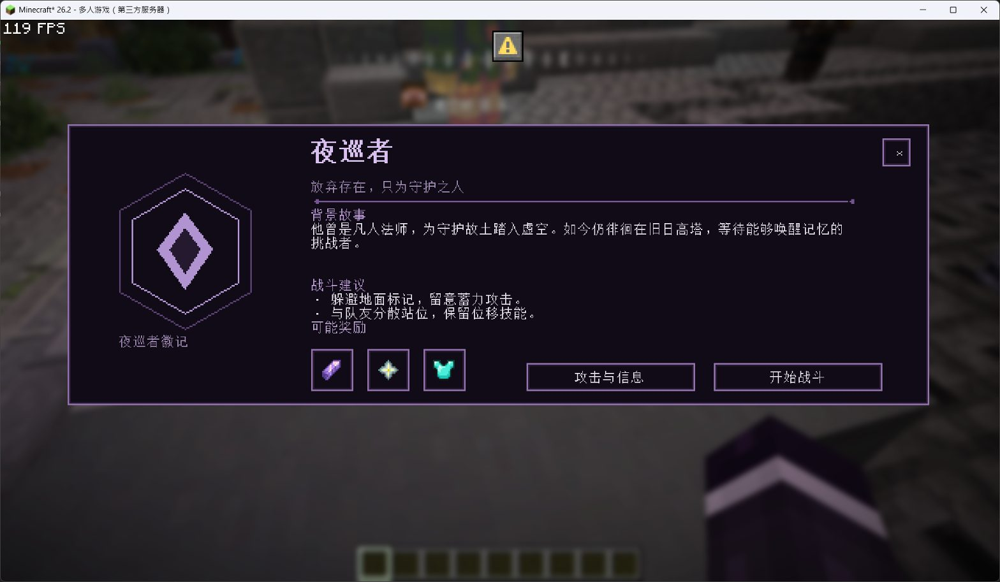
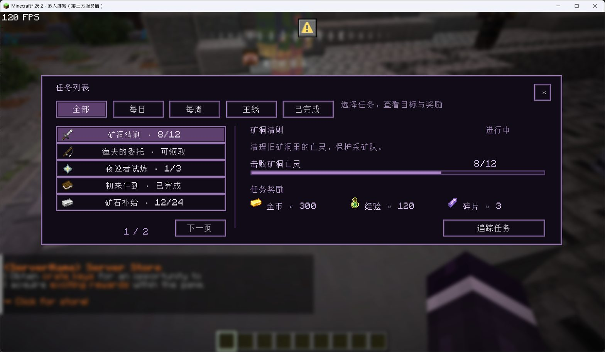

# DialogMenu · Minecraft 对话菜单

**简体中文** · [English](README.en.md)

DialogMenu 是一个基于 Minecraft Dialog 的菜单插件。你可以用 YAML 制作玩家设置、NPC 对话、首领介绍和确认界面，把文字、图标与交互按钮放进同一套菜单中。

一个文件就是一个完整菜单，相关子页面统一写在 `Pages` 下。简单的设置界面按顺序排列控件，需要自己设计版式时则使用画布坐标。插件附带可直接修改的示例，方便从现有菜单开始制作。

[下载插件与资源包](https://github.com/Usasi103/DialogMenu/releases/latest) · [配置指南](docs/guides/MENU-CONFIG.md) · [更新日志](CHANGELOG.md)

## 效果展示

以下为游戏内实拍，点击图片可查看原图。

| NPC 对话 | 首领介绍 | 任务列表 |
| :---: | :---: | :---: |
| [](docs/images/npc-dialogue.jpg?raw=true) | [](docs/images/boss-menu.jpg?raw=true) | [](docs/images/quest-menu.jpg?raw=true) |
| 角色图标与对话选项 | 背景故事、战斗建议与奖励 | 分类、分页与任务进度 |

## 可以制作什么

| 场景 | 功能 |
| --- | --- |
| 玩家设置 | 开关、按钮、档位滑条、下拉选择框、搜索与分类导航 |
| 对话与确认 | 多页跳转、条件显示、选项状态、玩家指令与控制台指令 |
| 自定义画布 | 调整元素位置、文字宽度、颜色与贴图；文字支持 6–24 号字体和加粗 |
| 物品展示 | 显示原版或其他插件的真实物品，保留模型及悬停提示 |
| 任务列表演示 | 每页最多 5 项，包含分类、详情、进度、奖励图标和“已完成”分类 |

设置菜单支持简体中文、英文以及暗色、亮色主题，玩家的语言与主题选择会保存。二元选项可使用绿色开启、灰色关闭的小开关，也可以保留宽按钮。档位滑条通过点击刻度或两侧箭头切换。

画布菜单支持 50%、75%、100% 整体缩放，在“界面与语言”中选择后自动保存，并应用到设置、任务和对话菜单。菜单显示不全时可输入 `/dmenu scale 50`。[配置与升级说明](docs/guides/MENU-SCALE.md)。

## 自带菜单

| 菜单 | 打开指令 | 用途 |
| --- | --- | --- |
| 设置演示 | `/dmenu open demo-settings` | 与玩家设置相同的布局；开关、滑条和下拉框独立演示，无需业务插件 |
| 对话演示 | `/dmenu open demo-dialogue` | NPC 对话和后续选项 |
| 首领演示 | `/dmenu open demo-boss` | 首领介绍、难度选择与进入确认 |
| 任务演示 | `/dmenu open demo-quests` | 任务分类、分页、详情与模拟领取 |

这些示例都能复制、改名和修改。首领确认不会自动召唤首领；任务演示不读取真实任务进度，也不发放物品或货币奖励。实际玩法可以通过按钮动作接入自己的插件。

`demo-settings` 的选项只在本次演示中生效，重新打开后重置；示例资产为固定数据。服务器已有的 `settings` 是真实玩家设置，继续使用原配置和入口。两者的状态彼此独立。[设置模板说明](docs/guides/SETTINGS-DEMO.md)。首领介绍与确认页默认最多显示为 75%（画布宽 414 GUI 像素），通过 `Canvas.MaxScale` 调整。

## 安装

已验证环境：**Paper 26.2、Java 25、Minecraft 26.2 客户端**。菜单皮肤需要配套资源包，玩家使用原版客户端即可。

1. 从下载页获取同一版本的插件 JAR 和 `DialogMenu-resourcepack-<版本>.zip`，将 JAR 放入服务器的 `plugins` 目录。
2. 将配套资源合入服务器资源包。使用 CraftEngine 时放入其资源包源目录，再执行 `/ce workflow default`。已有 GUI 着色器需要合并处理。
   CraftEngine 的 `exclude-file-extensions` 不能包含 `zip`，否则会漏掉 `assets/dialogmenu_settings/font/unifont.zip` 字体档案。
3. 启动服务器，在 `plugins/DialogMenu/config.yml` 的 `ResourcePack` 中指定发送方式及所需资源包。支持 CraftEngine 包 ID、ZIP 直链和外部发送的资源包 UUID；默认使用 CraftEngine 的 `default` 包。
4. 玩家加载资源包后，用 `/dmenu` 或 `/settings` 打开默认菜单。

首次安装会生成默认配置和四个示例菜单。已有配置会保留，修改后可用 `/dmenu check` 检查，再用 `/dmenu reload` 应用；检查失败时继续使用上一份有效配置。

## 写一个菜单

将下面的内容保存为 `plugins/DialogMenu/menus/my-menu.yml`，执行检查与重载后，用 `/dmenu open my-menu` 打开。文件名就是菜单 ID，无需额外注册。

```yaml
Version: 1
Type: settings
Title: "我的菜单"
DefaultPage: appearance
Language: zh_cn
Theme: dark
MainMenu: [close]

Pages:
  appearance:
    Title: "界面设置"
    Layout: [主题]
    Icons:
      主题:
        Type: dropdown
        Name: "菜单主题"
        Bind: theme
        Options:
          dark: "暗色"
          light: "亮色"
```

`Layout` 决定控件顺序，`Icons` 定义内容与动作。名称和说明可以直接写中文，也可写 `{zh_cn: 中文, en_us: English}` 提供两种语言。需要移动每个元素或更换画布样式时，使用 `Type: canvas`，详见配置指南。

## 插件联动

所有联动均为可选依赖，按菜单需要安装。

| 联动 | 用途 |
| --- | --- |
| PlaceholderAPI | 在文字中显示变量，或读取自定义开关和选项状态 |
| Ambience | 连接默认菜单中的环境音效、粒子及其整合的掉落、拾取设置；旧独立 LootBeam / PickupNotifier 也保留兼容 |
| CraftEngine | 提供自定义物品，并可负责资源包的构建与发送 |
| ItemBridge 物品源 | 支持内置 ItemBridge 版本的全部 39 种插件适配器，包括 Oraxen、ItemsAdder、SX-Item、NeigeItems、CraftEngine、MMOItems、Nexo 等；无需另装 ItemBridge |

物品源通过 `Display.Material: "source:插件ID:物品ID"` 配置。真实物品使用原生 Dialog 物品页面，物品模型需要对应插件的资源包。自由画布中的图标使用字体贴图，两者的配置方式见物品源指南。

## 常用指令

| 指令 | 说明 |
| --- | --- |
| `/dmenu help` | 查看帮助，管理员可见检查与重载指令 |
| `/dmenu`、`/settings` | 打开配置中的默认菜单 |
| `/dmenu open <菜单> [页面]` | 打开指定菜单或子页面 |
| `/dmenu check` | 检查配置，不应用修改 |
| `/dmenu reload` | 应用通过检查的配置，刷新已打开的菜单 |
| `/dmenu pack` | 发送配置的 URL 资源包，或提示资源包的发送方 |

主命令是 `/dialogmenu`，也可使用 `/dmenu`。权限 `playersettings.use` 默认向所有玩家开放；`playersettings.admin` 用于检查与重载，默认 OP 拥有。权限名沿用旧版本，已有权限配置可继续使用。

## 进一步了解

[文档目录](docs/README.md)：配置指南、旧版迁移资料与开发记录统一收录在 `docs/`。

中文详细 Wiki：[阅读手册](docs/wiki/README.md) · [离线网页版（下载后打开）](docs/wiki/index.html) · [完整目录](docs/wiki/SUMMARY.md)。覆盖新版 menus 的两类菜单、配置字段、动作、变量、物品源、资源包与可复制示例。

- [settings 坐标、字号与加粗](docs/guides/SETTINGS-LAYOUT.md)

- [菜单配置与画布布局](docs/guides/MENU-CONFIG.md)
- [On/Off 开关样式](docs/guides/SWITCHES.md)
- [对话、首领模板与字体设置](docs/guides/TEMPLATES.md)
- [任务列表演示](docs/guides/QUEST-DEMO.md)
- [物品源与物品页面](docs/guides/ITEM-SOURCES.md)
- [从 PlayerSettings 迁移](docs/guides/MIGRATION.md)
- [资源素材与使用范围](docs/guides/TEMPLATE-ASSETS.md)
- [验证记录](docs/development/VALIDATION.md)与[更新日志](CHANGELOG.md)
