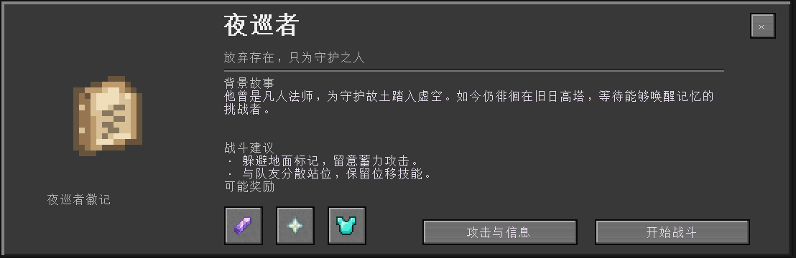
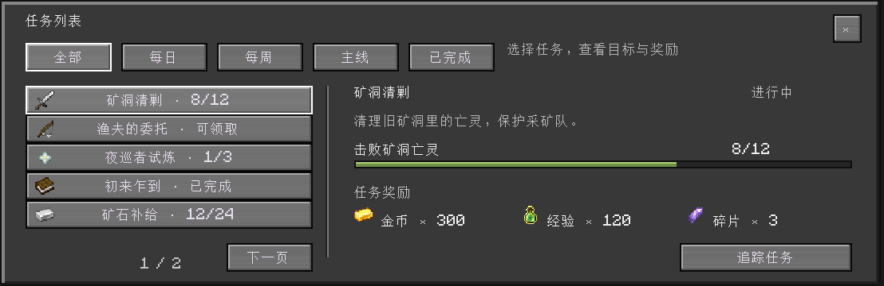

# DialogMenu · Minecraft 对话与全屏菜单

**简体中文** · [English](README.en.md)

DialogMenu 在一个插件中提供 Minecraft Dialog 菜单和资源包全屏演示。你可以用 YAML 制作玩家设置、NPC 对话、首领介绍和确认界面，把文字、图标与交互按钮放进同一套菜单中。

每份菜单在开头用 `MenuType: dialog` 或 `MenuType: fullscreen` 选择显示方式。Dialog 的相关子页面统一写在 `Pages` 下；全屏目前提供固定诊断布局，详见[全屏说明](docs/guides/FULLSCREEN.md)。简单的设置界面按顺序排列控件，需要自己设计版式时则使用画布坐标。插件附带可直接修改的示例，方便从现有菜单开始制作。

[下载插件与资源包](https://github.com/Usasi103/DialogMenu/releases/latest) · [配置指南](docs/guides/MENU-CONFIG.md) · [更新日志](CHANGELOG.md)

0.2.5 的菜单 CJK 复用原版客户端 Unihex，统一资源包保留字号和按钮基线，省去中文字图集。与 BetterHud 合包时保留公开字体着色器入口，见[字体与合包指南](docs/guides/NATIVE-FONT.md)。


动画预设入口支持 14 个原生 Dialog 图标效果：淡入淡出、飞入飞出、缩放、弹跳、脉冲、抖动、摇摆、旋转及上浮淡入淡出。通过界面切换或 `/dmenu open demo-animation <预设ID>` 指定，默认 30 tick 后停止刷新，可在 `animations.yml` 自定义每种预设的启动时间、基准结束时间、速率与演示错峰间隔。PNG 仍引用已有资源，字体及共用 shader 提供变换。预设可通过 Java API 复用，当前没有通用 YAML 动画字段；详见[动画指南](docs/guides/ANIMATION.md)。

## 效果展示

以下为游戏内实拍，点击图片可查看原图。

| 首领介绍 | 任务列表 |
| :---: | :---: |
| [](https://raw.githubusercontent.com/Usasi103/DialogMenu/main/docs/images/boss-menu.png) | [](https://raw.githubusercontent.com/Usasi103/DialogMenu/main/docs/images/quest-menu.png) |
| 背景故事、战斗建议与奖励 | 分类、分页与任务进度 |

## 可以制作什么

| 场景 | 功能 |
| --- | --- |
| 玩家设置 | 开关、按钮、档位滑条、下拉选择框、搜索与分类导航 |
| 对话与确认 | 多页跳转、条件显示、选项状态、玩家指令与控制台指令 |
| 自定义画布 | 调整元素位置、文字宽度、颜色与贴图；文字支持 6–24 号字体和加粗；可按 PlaceholderAPI 变量显示文字、隐藏元素或切换图片 |
| 物品展示 | 显示原版或其他插件的真实物品，保留模型及悬停提示 |
| 任务列表演示 | 每页最多 5 项，包含分类、详情、进度、奖励图标和“已完成”分类 |

设置菜单支持简体中文、英文以及暗色、亮色主题，玩家的语言与主题选择会保存。二元选项可使用绿色开启、灰色关闭的小开关，也可以保留宽按钮。档位滑条通过点击刻度或两侧箭头切换。

Dialog 菜单使用配置中的原始画布尺寸。显示不全时，可在 Minecraft 视频设置中调小 GUI 比例。

## 自带菜单

| 菜单 | 打开指令 | 用途 |
| --- | --- | --- |
| 设置演示 | `/dmenu open demo-settings` | 与玩家设置相同的布局；开关、滑条和下拉框独立演示，无需业务插件 |
| 对话演示 | `/dmenu open demo-dialogue` | NPC 对话和后续选项 |
| 首领演示 | `/dmenu open demo-boss` | 首领介绍、难度选择与进入确认 |
| 全屏演示 | `/dmenu open demo-fullscreen` | 本地黄色光标、四角按钮、点击与返回 Dialog；先配置 fullscreen.yml |
| 任务演示 | `/dmenu open demo-quests` | 任务分类、分页、详情与模拟领取 |

这些示例都能复制、改名和修改。首领确认不会自动召唤首领；任务演示不读取真实任务进度，也不发放物品或货币奖励。实际玩法可以通过按钮动作接入自己的插件。

`demo-settings` 的选项只在本次演示中生效，重新打开后重置；示例资产为固定数据。服务器已有的 `settings` 是真实玩家设置，继续使用原配置和入口。两者的状态彼此独立。[设置模板说明](docs/guides/SETTINGS-DEMO.md)。

## 安装

**DialogMenu 0.2.6** 面向 **Paper / 原版客户端 26.3**，使用 Java 25 构建并运行服务器，主源码输出 Java 21 字节码。菜单皮肤需要配套资源包，玩家使用原版客户端即可；旧的 1.21.11 / 26.2 验证记录见[历史兼容记录](docs/development/PAPER-1.21.11.md)。

源码为 Java，共享库 Keystone 已打包在插件内。全屏通过匹配 26.3 的 NMS 和资源包实现，不需要额外全屏插件或 TorakaHud。现有菜单升级前必须在第一个配置项补上 `MenuType: dialog`；Version 3 全局 config.yml 不加该字段。具体测试边界见[发布验证](RELEASE-VALIDATION.md)。

1. 将插件 JAR 放入服务器的 `plugins` 目录。0.1.21 起已内置配套资源，启动时导出到 `plugins/DialogMenu/resourcepack/DialogMenu-resourcepack.zip`。
2. 新安装默认使用 `ResourcePack.Provider: Auto`，按 **CraftEngine → ItemsAdder → Nexo → Oraxen** 的顺序选择已启用的资源管理插件，并将资源放入其源目录。再次启动会更新由 DialogMenu 管理的文件，保留服主修改过的文件；冲突会在控制台列出。
3. 按控制台提示让所选插件重新构建并发送资源包。没有这些插件时，可手动启用导出的 ZIP，或配置 URL / External 发送方式。自动复制资源不会替代资源包的构建、托管和客户端加载；与 BetterHud 共用时仍需保留其原包并合并资源。
4. 玩家加载资源包后，用 `/dmenu` 或 `/settings` 打开默认菜单。新安装默认关闭加载回执检查；已配置的 CraftEngine / URL / External 方式及检查开关会保留。

发布版 0.1.20 及更早版本仍需另下载同版本资源包并手动合入。完整的自动安装目录、冲突处理和发送配置见[资源包指南](docs/wiki/resource-pack.md)。

首次安装会生成默认配置和五个示例菜单。全屏资源内置于同一个 JAR，首次使用前在 fullscreen.yml 填写可访问的基础 URL，见[全屏安装步骤](docs/guides/FULLSCREEN.md)。已有配置会保留，修改后可用 `/dmenu check` 检查，再用 `/dmenu reload` 应用；检查失败时继续使用上一份有效配置。

## 写一个菜单

将下面的内容保存为 `plugins/DialogMenu/menus/my-menu.yml`，执行检查与重载后，用 `/dmenu open my-menu` 打开。文件名就是菜单 ID，无需额外注册。

```yaml
MenuType: dialog
Version: 1
Type: settings
Title: "我的菜单"
DefaultPage: appearance
Language: zh_cn
Theme: dark
MainMenu: [close]

Pages:
  appearance:
    Title: "界面设置"
    Layout: [主题]
    Icons:
      主题:
        Type: dropdown
        Name: "菜单主题"
        Bind: theme
        Options:
          dark: "暗色"
          light: "亮色"
```

`Layout` 决定控件顺序，`Icons` 定义内容与动作。名称和说明可以直接写中文，也可写 `{zh_cn: 中文, en_us: English}` 提供两种语言。需要移动每个元素或更换画布样式时，使用 `Type: canvas`，详见配置指南。

## 插件联动

所有联动均为可选依赖，按菜单需要安装。

| 联动 | 用途 |
| --- | --- |
| PlaceholderAPI | 在文字中显示变量，或读取自定义开关和选项状态 |
| Ambience | 连接默认菜单中的环境音效、粒子及其整合的掉落、拾取设置；旧独立 LootBeam / PickupNotifier 也保留兼容 |
| CraftEngine | 提供自定义物品，并可负责资源包的构建与发送 |
| ItemBridge 物品源 | 支持内置 ItemBridge 版本的全部 39 种插件适配器，包括 Oraxen、ItemsAdder、SX-Item、NeigeItems、CraftEngine、MMOItems、Nexo 等；无需另装 ItemBridge |

物品源通过 `Display.Material: "source:插件ID:物品ID"` 配置。真实物品使用原生 Dialog 物品页面，物品模型需要对应插件的资源包。自由画布中的图标使用字体贴图，两者的配置方式见物品源指南。

## 常用指令

| 指令 | 说明 |
| --- | --- |
| `/dmenu help` | 查看帮助，管理员可见检查与重载指令 |
| `/dmenu`、`/settings` | 打开配置中的默认菜单 |
| `/dmenu open <菜单> [页面]` | 打开指定菜单或子页面 |
| `/dmenu check` | 检查配置，不应用修改 |
| `/dmenu reload` | 应用通过检查的配置，刷新已打开的菜单 |
| `/dmenu pack` | 发送配置的 URL 资源包，或提示资源包的发送方 |

主命令是 `/dialogmenu`，也可使用 `/dmenu`。权限 `playersettings.use` 默认向所有玩家开放；`playersettings.admin` 用于检查与重载，默认 OP 拥有。权限名沿用旧版本，已有权限配置可继续使用。

## 进一步了解

[文档目录](docs/README.md)：配置指南、旧版迁移资料与开发记录统一收录在 `docs/`。

中文详细 Wiki：[阅读手册](docs/wiki/README.md) · [离线网页版（下载后打开）](docs/wiki/index.html) · [完整目录](docs/wiki/SUMMARY.md)。覆盖 Dialog 菜单的 settings / canvas 内容结构、配置字段、动作、变量、物品源、资源包与可复制示例。

- [settings 坐标、字号与加粗](docs/guides/SETTINGS-LAYOUT.md)

- [菜单配置与画布布局](docs/guides/MENU-CONFIG.md)
- [On/Off 开关样式](docs/guides/SWITCHES.md)
- [对话、首领模板与字体设置](docs/guides/TEMPLATES.md)
- [任务列表演示](docs/guides/QUEST-DEMO.md)
- [物品源与物品页面](docs/guides/ITEM-SOURCES.md)
- [从 PlayerSettings 迁移](docs/guides/MIGRATION.md)
- [资源素材与使用范围](docs/guides/TEMPLATE-ASSETS.md)
- [验证记录](docs/development/VALIDATION.md)与[更新日志](CHANGELOG.md)
